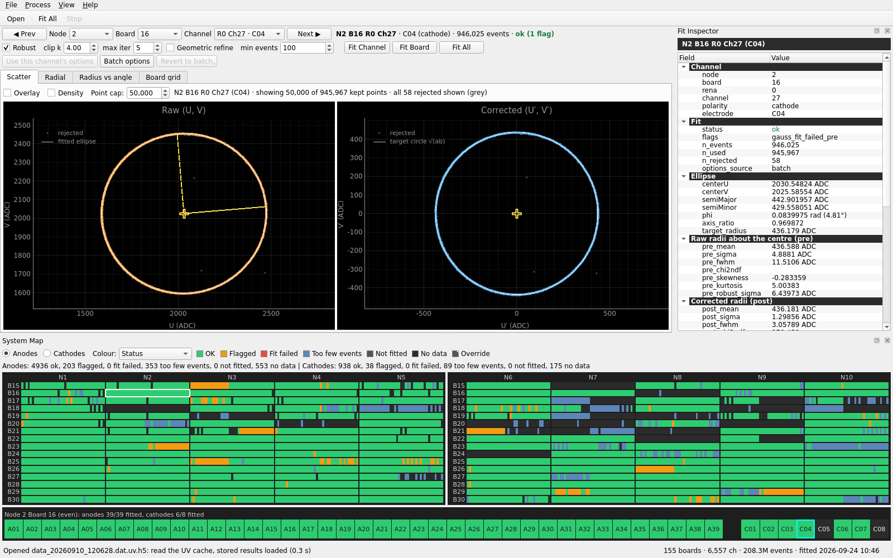
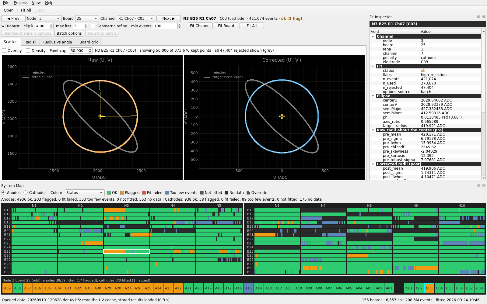
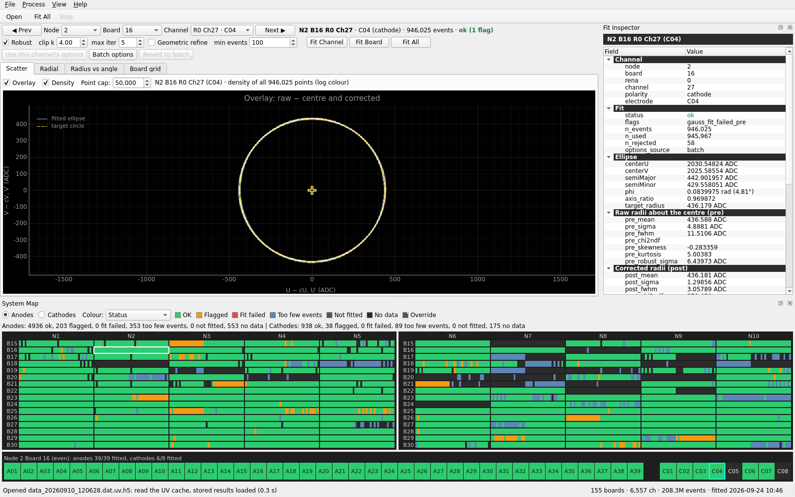
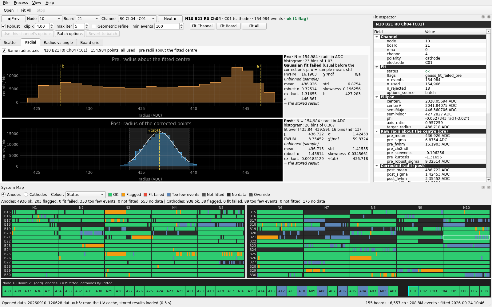
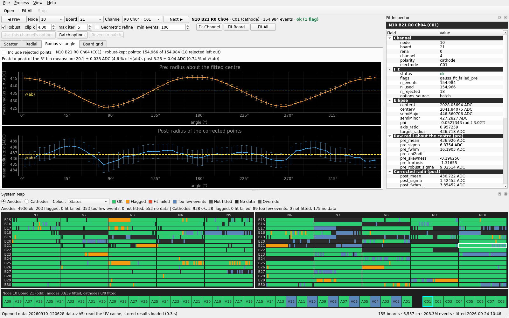
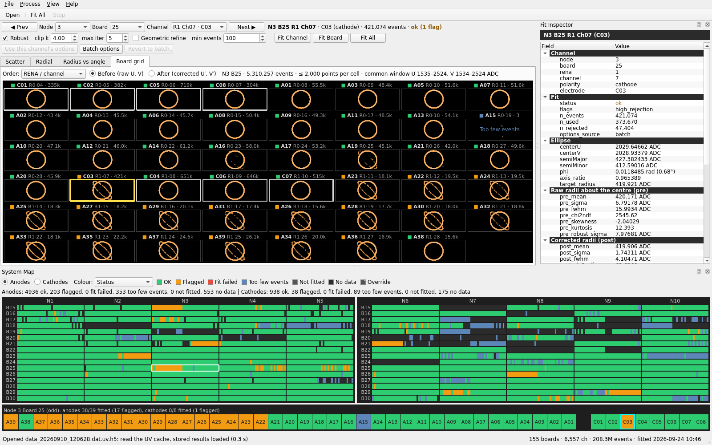
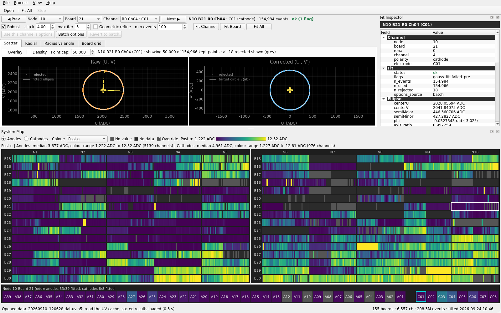
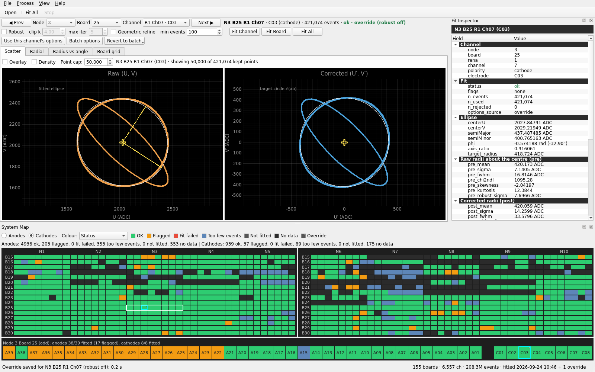

# uvcorr GUI: user guide

`uvcorr-gui` views the ellipse correction of every channel, re-fits channels or boards with other
options, and exports the results. The window follows the adc2kev 2.2.7 GUI conventions: docks
with object names, `QSettings` persistence, `QThread` workers with Stop, and a System Map forked
from adc2kev's. For the method, see [ALGORITHM.md](ALGORITHM.md). For the CLI, the cache and the
output formats, see the [README](../README.md).



*Test file cache with its stored results, on a 1600 x 1000 window. The Scatter tab shows the
largest channel, N2 B16 R0 Ch27 (C04, 946,025 events), capped at 50,000 kept points; its 58
rejected points are drawn in grey. The Fit Inspector is on the right and the System Map in
Status mode at the bottom, with board N2 B16 magnified in the strip.*

---

## 1. Starting

```bash
uvcorr-gui                          # empty window
uvcorr-gui data.dat                 # open a raw file: reuse its UV cache or build it
uvcorr-gui data.dat.uv.h5           # open a UV cache directly
uvcorr-gui --workers 2 data.dat     # Fit All with 2 worker processes (default min(8, usable CPUs))
uvcorr-gui -v data.dat              # log to stderr (-v info, -vv debug)
```

A file name ending in `.uv.h5`, `.h5` or `.hdf5` is opened as a cache, and anything else as raw
data. Ctrl+C in the terminal closes the window: unlike *File > Exit*, it stops running work
without asking. Both save the layout.

## 2. Window layout

| Part | Content |
|------|---------|
| Menu bar | **File**, **Process**, **View**, **Help** (2.1) |
| Toolbar | **Open** (a raw file or a cache), **Fit All**, **Stop** |
| Control band | Channel navigation and status, fit options and fit buttons (2.2) |
| Central tabs | **Scatter**, **Radial**, **Radius vs angle**, **Board grid** (section 5) |
| Right dock | **Fit Inspector** (section 6) |
| Bottom dock | **System Map** (section 7) |
| Status bar | Messages on the left. On the right: the open file's summary, e.g. `155 boards · 6,557 ch · 208.3M events · fitted 2026-09-24 10:46 + 1 override` (its tooltip gives the cache path), and a progress bar while an operation runs |

The window title is `<file> — uvcorr 0.1.0`.

### 2.1 Menus

| Menu | Entry | Shortcut | Effect |
|------|-------|----------|--------|
| File | Open Raw... | Ctrl+O | Open a raw `.dat` (section 3.1) |
| | Open Cache... | Ctrl+Shift+O | Open a UV cache directly (section 3.2) |
| | Export .tec... | | Section 10 |
| | Export CSV... | | Section 10 |
| | Export Both... | Ctrl+E | Section 10 |
| | Exit | Ctrl+Q | Close; asks first if an operation is running |
| Process | Fit All | Ctrl+F | Section 8 |
| | Stop | | Stop a cache build, Fit All or board re-fit |
| | Revert Channel to Batch | | Section 9.3; the text names the target, e.g. *Revert N1 B15 R0 Ch12 to Batch* |
| | Revert Board to Batch | | Section 9.3, e.g. *Revert N1 B15 to Batch (6 overrides)* |
| | Clear All Overrides... | | Section 9.3; shows the count, e.g. *Clear All Overrides (6)...* |
| View | Fit Inspector, System Map | | Show or hide the dock |
| | Focus System Map | Ctrl+M | Show the map and give its board strip the keyboard focus |
| | Reset Layout | | Forget the saved layout and apply the default size and docks |
| Help | About | | Version |

When Fit All, an export entry or one of the band's fit buttons is disabled, its tooltip (and, for
a menu entry, the status bar on hover) gives the reason. Before a file is open, Fit All and the
re-fits read *Open a raw .dat file or a UV cache first*; the exports read *Nothing to export yet:
run Fit All first*, before a file is open as before the first batch; the re-fits before a batch,
*Run Fit All first*; while an operation runs, *Wait for the running operation to finish*.

### 2.2 Control band

The band has two rows that wrap on a narrow window. At 1600 px the last three buttons wrap to a
third line, as in the screenshots.

```
Row 1:  [◀ Prev] Node [2 ▾] Board [16 ▾] Channel [R0 Ch27 · C04 ▾] [Next ▶]   N2 B16 R0 Ch27 · C04 (cathode) · 946,025 events · ok (1 flag)
Row 2:  [x] Robust  clip k [4.00]  max iter [5]  [ ] Geometric refine  min events [100]  | [Fit Channel] [Fit Board] [Fit All]
        | [Use this channel's options] [Batch options] [Revert to batch ▾]
```

| Widget | Meaning |
|--------|---------|
| Prev / Next, Node / Board / Channel | Navigation (section 4) |
| Channel label | Address, electrode, polarity, events, and the status in its System Map category colour: `ok`, `ok (2 flags)`, `too_few_events`, `ok · override (robust off)`, `not fitted`, `no data` |
| Robust, clip k, max iter | The robust clip-and-refit (clip k 0.5-50, max iter 1-100). clip k and max iter are greyed out while Robust is off |
| Geometric refine | Least-squares refinement on the radial residuals |
| min events | At least 6 |
| Fit Channel, Fit Board | Re-fit with these options (section 9). Need stored batch results |
| Fit All | Section 8 |
| Use this channel's options | Load the selected channel's override options (section 9.2) |
| Batch options | Load the stored batch options, or the defaults before the first Fit All (section 9.2) |
| Revert to batch | A menu with *Revert Channel to Batch* and *Revert Board to Batch* (section 9.3) |

The band edits five `FitOptions` fields. The other four (`phase_ref_freq_hz` and the three flag
thresholds) come from the stored batch options and cannot be changed in the GUI. On opening a
file the band shows the stored batch options (the defaults without results). A field left as
loaded keeps the exact stored value, even where the widget rounds it. The band's options are not
saved between sessions.

### 2.3 Docks and default layout

Both docks can be hidden (View menu), floated or moved. On first launch the window takes 85 % of
the available screen, capped at 1920 x 1200 px, and is centred. It opens maximized when the
available height is below 900 px, or when 85 % would be within 25 % of the window's minimum size.
The System Map gets 36 % of the window height, or 30 % (at most 280 px) when the window is less
than 900 px high, and the Fit Inspector 24 % of the width (at least 340 px). The layout is saved on exit (section 11).

---

## 3. Opening data

### 3.1 A raw `.dat` (File > Open Raw..., Ctrl+O)

The cache is always `<dat>.uv.h5` next to the raw file (a cache elsewhere: build it with `uvcorr
build-cache --cache PATH` and use *Open Cache*).

| Situation | What happens |
|-----------|--------------|
| A valid cache exists | It is reused: *"Opening data.dat (its UV cache is up to date)…"*, busy indicator only |
| No cache, or a stale one without results | The cache is built in a worker thread: *"Building the UV cache of data.dat…"*, with a progress bar. **Stop** ends the build: *"Cache build stopped; no cache was written"*, and any previous cache is untouched |
| A stale cache that stores results | First the question **"Rebuild the UV cache?"**: *"The UV cache … is out of date for data.dat and will be rebuilt. Its stored results and overrides will be discarded."* No leaves everything as it is |
| Another process has the cache open for writing | Error dialog: *"… is in use by another process (HDF5 file lock); try again when it has finished"*. Nothing is rebuilt |
| The file has no valid frames (not raw data, or an empty file) | Error: *"no valid frames in X: is this a raw .dat file?"*. The build fails as in `uvcorr build-cache`: no cache is written, and any previous cache is untouched |
| A raw file without events on active channels | Error: *"X holds no events on active channels"*. An empty cache built by this open is removed again |
| Too little disk space, an unwritable directory | Error dialog; nothing is left behind |

A cache is stale when the `.dat` size, mtime or first-MiB hash, or the cache layout version,
has changed (see the README).

### 3.2 A UV cache (File > Open Cache..., Ctrl+Shift+O)

The cache is opened as it is: it is never rebuilt, and the raw file does not need to exist. The
raw path recorded in the cache gives the export name. If that raw file exists but has changed
since the build, the status bar adds *"warning: the cache is out of date for its raw file (open
the .dat to rebuild)"*. A cache of another layout version is refused (*"open the raw .dat file to
rebuild it"*).

### 3.3 After opening

The stored results (`/results/current` and its overrides) are loaded, so a fitted cache shows
everything at once without a refit (0.3 s for the test file). Without stored results every
board is scanned once for its channels (about 2 s for 155 boards), and the channels show as
*not fitted* until Fit All. If the stored results cannot be decoded, a warning says so. The
events can still be browsed, and Fit All replaces the results. The band shows the batch options,
and the first channel with events is selected. The status bar says what happened, e.g.
*"Opened data_20260910_120628.dat.uv.h5: read the UV cache, stored results loaded (0.3 s)"*.

---

## 4. Browsing channels

Every selection updates the band, the System Map, the Fit Inspector and the tabs, whichever
widget made it.

| Control | Effect |
|---------|--------|
| System Map: click a cell | Select that channel. The board strip gets the keyboard focus |
| System Map: click a dark (no data) tile | Select the board only: the tabs show *"Node N Board B: no events on this board"* |
| Board strip: click | Select that electrode |
| Board strip keys | Section 13 (Left/Right along the board, Up/Down between boards, Ctrl+Left/Right between nodes) |
| Prev / Next | Previous / next channel **with events** in (node, board, RENA, channel) order, across boards, stopping at the ends. From a board selected without a channel, Next goes to its first channel and Prev to its last |
| Node combo | The same board number on the new node if it has data, else its first board; the same RENA/channel there if it has events, else the first channel |
| Board combo | The same RENA/channel on the new board, else its first channel |
| Channel combo | The channels with events on the board, as `R0 Ch27 · C04` |
| Board grid: click a cell | Select that channel |

Loading runs in the background. The scatter is drawn first, then the Radial and Radius vs angle
tabs. A newer selection supersedes a pending load, so stepping quickly through large channels
never queues work. On the test file the scatter appears after about 0.15 s for a 100k-event
channel and after 0.4 s for the largest (946k events). The session keeps the last 4 boards in memory (about
8 MB each, 45 MB for the largest).

A channel with events but without a result (not fitted yet) shows its raw points only, as do
`too_few_events` and `fit_failed` channels. A message above the plots says why, e.g. *"Too few
events (40 < min events 100): no ellipse was fitted, raw points only."* A channel without events
shows *"No events on this channel (no data)."*

---

## 5. The tabs

### 5.1 Scatter

Two linked panels, each with a locked 1:1 aspect ratio:

- **Raw (U, V)**: the points (orange), the fitted ellipse, its centre (+), the semi-major axis a
  (solid yellow line) and the semi-minor axis b (dashed).
- **Corrected (U′, V′)**: the corrected points (blue), centred on the origin, with the target
  circle r = √(ab).

The panels are linked by a translation: the corrected panel shows the same span as the raw one,
shifted by the ellipse centre, so zooming or panning either panel follows the same part of the
ring in both. For a fitted channel the view opens at ±1.15 a around the centre.

| Control | Effect |
|---------|--------|
| Overlay | One panel with the raw points minus the centre and the corrected points on the same centred axes, the fitted ellipse and the dashed target circle. It needs a fitted ellipse |
| Density | Log-coloured 2D histograms (viridis) of **all** points instead of points, over a square around the ring. Bins are a whole number of ADC wide and aligned to the integer U/V lattice (at most 256 per axis), so there is no moiré. With Overlay the two histograms are blended additively: orange raw, blue corrected, white where they coincide. The kept/rejected split is not shown |
| Point cap | Most **kept** points drawn per panel: default 50,000, range 1,000-300,000. Above the cap a deterministic random subsample is drawn, seeded by the channel address, so a channel always shows the same points. The rejected points are drawn **in addition**, all of them up to 50,000 |

The info line says what is drawn: *"showing 50,000 of 945,967 kept points · all 58 rejected
shown (grey)"*, or *"density of all 946,025 points (log colour)"*.

**Rejected points** (grey) are the points the robust fit left out. The stored results do not
include the kept/rejected mask, so the scatter recomputes it by re-running the fit with the
options the row was fitted with: the batch options, or the override's own. The fit is
deterministic. If it does not reproduce the stored ellipse and kept count, a message says so and
the stored ellipse is drawn. The ellipse and the correction drawn are always the stored ones,
which are what the exports contain.



*N3 B25 R1 Ch07 (C03, 421,074 events, `high_rejection`): 47,404 events (11 %) lie on a second,
thin ellipse (b/a ≈ 0.30, φ ≈ −44°) concentric with the main ring. The robust fit rejects them
(grey), corrects the main ring to the target circle, and leaves the second population elliptical
([ALGORITHM 7.5](ALGORITHM.md#75-high_rejection_frac-005-and-extreme_axis_ratio-05-the-second-ellipse)).*



*Overlay + Density on N2 B16 R0 Ch27: every one of the 946,025 points, raw − centre and
corrected, on one axis pair.*

### 5.2 Radial

Two stacked histograms, each with a text box:

- **Pre: radius about the fitted centre**: radii of the raw points about the **fitted** ellipse
  centre (not a histogram-peak centre), with the semi-axes b and a marked (dashed). An
  uncorrected ellipse spreads its radii between b and a, often as a double horn, so this
  Gaussian fit often fails. That is the informational flag `gauss_fit_failed_pre`.
- **Post: radius of the corrected points**: radii |(U′, V′)|, with √(ab) marked.

Each panel draws exactly what the analysis fitted: the histogram over the [0.5, 99.5]
percentiles, and the Gaussian curve over the accepted fit range (the shaded band). The text box
gives:

- the binning (e.g. *"histogram: 20 bins of 0.367"*) and the fit range with its bins and ndf;
- the Gaussian μ, σ, FWHM and χ²/ndf (the Baker-Cousins deviance per degree of freedom);
- the unbinned sample mean and std, the robust σ (1.4826 MAD), the skewness, the excess kurtosis
  and the marker radii.

A failed fit is reported as *"Gaussian fit failed (usual before the correction): μ, σ = sample
mean, std"*. It is in the warning colour when it is not expected.

**The numbers are the stored results.** The tab recomputes the statistics with the routine behind
the `pre_*` / `post_*` columns, over all finite events of the channel, including the rejected
ones, as the analysis does. It compares all seven values with the stored row: a match adds
*"= the stored result"*, and a mismatch is named in the warning colour.

*Same radius axis* (default on) shows both panels over one radius range with linked zoom, so
the narrowing by the correction is visible. Off, each panel is scaled to its own histogram.
The view opens on μ ± 5σ of the fit when that is narrower than the histogram. When the plotted
range hides part of a histogram, the box counts the radii outside it. A channel without an
ellipse shows its raw radius histogram about the median point, labelled as such, and no post
panel.



*N10 B21 R0 Ch04 (C01, 154,984 events): the pre radii are spread between b = 427.3 and a = 446.4
ADC and the Gaussian fit fails, as usual before the correction. After the correction the radii
are Gaussian with σ = 1.42 ADC. Both boxes read "= the stored result".*

### 5.3 Radius vs angle

The mean radius ± σ (std, ddof 0) in 72 bins of 5°, for two sets of points:

- **Pre**: radius about the fitted centre against atan2(V − cV, U − cU). An uncorrected ellipse
  shows a two-cycle modulation between b and a.
- **Post**: radius of the corrected points against atan2(V′, U′). It is flat at √(ab) for a
  perfect correction.

Empty bins are gaps in the line, and the dashed line is √(ab). By default only the points the
robust fit **kept** are binned, so a second population does not pull the bin means. *Include
rejected points* bins every event, and the info line always says which set is shown, e.g.
*"robust-kept points: 154,966 of 154,984 (18 rejected left out)"*. Without a mask (no ellipse, or
the recomputed fit did not reproduce the stored one) all points are binned and the checkbox is
disabled.

The summary line gives the **peak-to-peak** modulation of the bin means, pre and post. It uses
only bins with at least 10 points, and gives ± the standard error of the difference of the two
extreme bin means, √(sem_max² + sem_min²). For example: *"Peak-to-peak of the 5° bin means: pre
20.1 ± 0.038 ADC (4.6 % of √(ab)), post 3.25 ± 0.04 ADC (0.74 % of √(ab))"*. A flat profile gives
a few times that error.



*The same channel: a 20.1 ADC two-cycle modulation before the correction, 3.25 ADC after.*

### 5.4 Board grid

The 47 active channels of the selected board as small plots in an 8 x 6 grid.

| Control | Options |
|---------|---------|
| Order | **RENA / channel**: RENA 0 channels 4-28, then RENA 1 channels 7-28. **Physical strip order**: the 39 anodes by strip position (as in the System Map's strip; odd boards start at A39), one empty slot, then the cathodes C01-C08 on the last row |
| Before (raw U, V) | Raw points with the fitted ellipse, over **one U/V window common to the board**: the union of the fitted ellipses' bounding boxes plus a margin |
| After (corrected U′, V′) | Corrected points with the target circle, centred at 0 with one common half-width (1.2 × the largest √(ab)) |

**Outlier handling.** One bad fit must not squash the other 46 rings, so the common window leaves
out fits flagged `extreme_axis_ratio` and fits whose centre lies far from the median centre of
the fits on the same RENA. "Far" means more than max(5 × 1.4826 MAD, 0.1 × median a, 10 ADC) in
U or V. The median and the MAD are taken over the fits on that RENA, the fit itself included,
because a whole RENA can sit at its own offset, or over the whole board when the RENA has fewer
than 3 fits. The left-out channels are
still drawn, possibly clipped. The info line gives the window, e.g. *"N3 B25 · 5,310,257 events ·
≤ 2,000 points per cell · common window U 1535–2524, V 1534–2524 ADC"*. When fits were left out
it adds *"· N fits left out of it (M clipped: A15, …)"*, naming up to four clipped channels.

Each cell draws at most 2,000 points, a deterministic subsample in one colour; the kept/rejected
split is not known here. A channel without an ellipse shows its raw points; in the After view
they are centred on its median point, and the cell says so. A channel without events shows *no
data*. Cathodes are outlined. Each cell title starts with a square in its status colour, then
the electrode, `R0·04` and the event count, and the selected channel is outlined in yellow.
Hovering gives the status, the flags, the events drawn, b/a, √(ab), post σ and the rejected
fraction. **Click a cell to open the channel.** The grid is computed only while its tab is
shown, in 0.2 s for the largest board.



*N3 B25, Before, RENA / channel order. Most of RENA 1 shows the second population (orange,
flagged) and A15 (R0 Ch19) has 3 events (too few). C03 is selected.*

---

## 6. Fit Inspector

The right dock lists every field of the selected channel's result: the `radial_summary.csv`
columns, which are also the fields stored in the cache. Values are selectable, and each row's
tooltip gives the full value.

| Group | Fields |
|-------|--------|
| Channel | node, board, rena, channel, polarity, electrode |
| Fit | status (in its category colour), flags, n_events, n_used, n_rejected, options_source |
| Ellipse | centerU, centerV, semiMajor, semiMinor (9 digits, ADC), phi (rad and degrees), axis_ratio, target_radius |
| Raw radii about the centre (pre) | pre_mean, pre_sigma, pre_fwhm, pre_chi2ndf, pre_skewness, pre_kurtosis, pre_robust_sigma |
| Corrected radii (post) | the same post_* fields |
| Residuals | rawfit_res_mean/sigma, corr_res_mean/sigma |
| Phase and timing | phase_mean_gap_rad, phase_max_gap_rad, phase_max_gap_ns, phase_ks, timing_jitter_ns |
| Flags: N | Each flag with a one-line explanation, thresholds filled in from the options used, e.g. *"The robust fit rejected more than 5% of the events."* |
| Options used: batch (Fit All of 2026-09-24 10:46) / override (robust off) | All nine `FitOptions`: min events, robust, clip k, max iter, geometric, ref freq (Hz), high rej. >, axis ratio <, broad ring >. An override's header names how its options differ from the batch |

Unavailable values are empty (a `too_few_events` channel has only its identity, status, flags,
event count and options source). A channel without a result shows its identity and *not
fitted* or *no data*. Column meanings: [README, radial_summary.csv](../README.md#radial_summarycsv).

---

## 7. System Map

The bottom dock draws both detector panels at electrode granularity: panel 1 (nodes 1-5) and
panel 2 (nodes 6-10). Columns are nodes, and rows are boards 15 (top) to 30. Each board tile is
split into its 39 anodes (**Anodes**) or its 8 cathodes (**Cathodes**) in physical strip order;
even boards read A01..A39 and odd boards A39..A01, from the low-node side. Boards without data
are uniform dark tiles. The selected board has a white outline and the selected channel a cyan
one.

Below the grids, the **board strip** magnifies the selected board: 39 anodes, a gap, then the 8
cathodes, with labels. It always shows both kinds, and its header reads e.g. *"Node 3 Board 25
(odd): anodes 38/39 fitted (17 flagged), cathodes 8/8 fitted (1 flagged)"*; a channel counts as
fitted when its status is `ok`. Above the grids are the Anodes/Cathodes choice, the **Colour:**
selector, the legend (and, in a metric mode, the colour bar) and a summary line. A warning line appears only for
boards outside the grid or results on channels that are not electrodes.

Hovering a cell shows its electrode, strip position, address, status, flags (all of them,
informational ones included), options source (`batch` or `override`), events, post σ, jitter,
KS D, b/a and rejected fraction. Hovering a no-data tile shows the board summary.

### 7.1 Status mode

| Category | Colour | Rule |
|----------|--------|------|
| OK | green `#2ecc71` | `ok`, and no flag other than an informational one |
| Flagged | orange `#f39c12` | `ok` with at least one warning flag |
| Fit failed | red `#e74c3c` | `fit_failed` |
| Too few events | muted blue `#5d86b8` | `too_few_events` |
| Not fitted | grey `#555555` | Events but no result yet |
| No data | dark `#2b2b2b` | No events on the channel (or the board) |

**Informational flags.** `gauss_fit_failed_pre` does not make a channel *Flagged*. The raw radii
of an uncorrected ellipse spread between b and a and are not Gaussian, so the flag says nothing
about the correction: 1,093 of the 6,115 `ok` channels of the test file carry it, mostly the
best, thinnest rings. It is still listed in the tooltips, the Fit Inspector and the band's flag
count, and the band colours such a channel as OK. With this rule the test file shows 241 flagged
channels instead of 1,299. The same categories colour the band's status, the Fit Inspector's
status and the Board grid's cell squares.

The summary line counts the categories per kind: *"Anodes: 4936 ok, 203 flagged, 0 fit failed,
353 too few events, 0 not fitted, 553 no data | Cathodes: 938 ok, 38 flagged, …"*.

### 7.2 Metric modes

| Colour | Metric |
|--------|--------|
| Post σ | `post_sigma` (ADC) |
| Jitter | `timing_jitter_ns` (ns) |
| KS D | `phase_ks` |
| Axis ratio b/a | `axis_ratio` |
| Rejected fraction | `n_rejected / n_events` (%) |

The value is mapped onto the viridis colormap. The limits are the **2nd and 98th percentiles**
of the finite values, taken separately for anodes and cathodes, so a few outliers do not wash
out the detector. The colour bar shows the metric and the limits of the kind the grids show. The
summary gives the median and the colour range of each kind: *"Post σ | Anodes: median 3.677
ADC, colour range 1.222 ADC to 12.52 ADC (5139 channels) | Cathodes: …"*. A channel without the
value (`too_few_events`, `fit_failed`, not fitted) is grey (*No value*), and a channel without
events is *No data*. Switching modes only recolours the map, so it is instant. The mode and the
Anodes/Cathodes view are saved.

*Rejected fraction* finds the second-population channels, and *Post σ* separates the thin rings
of nodes 1-4 from the broad, flat-topped rings of nodes 5, 6 and 8-10.



*Post σ mode (anodes; colour range 1.22-12.5 ADC): thin rings dark, broad flat-topped rings
green to yellow, channels without a value grey.*

### 7.3 Override markers

A channel whose result comes from an override carries a small white corner tick (a dog-ear) in
the top-right of its cell. The tick is drawn in the strip, and in the grids when the cells are at
least 6 px wide (in practice the Cathodes view; anode cells are about 4 px). The legend entry
*Override* explains it in every mode. See the C03 cell in the screenshot of section 9.

### 7.4 Interactions

| Action | Effect |
|--------|--------|
| Left click on a cell | Select the channel (section 4) |
| Left click on a no-data tile | Select the board only |
| Right click on a cell or tile | Context menu: **Fit Channel  C03 (RENA 1 Ch 7)** (on a cell) and **Fit Board  Node 3 Board 25**, with the control band's options. When overrides exist: **Revert Channel to Batch  C03** and **Revert Board to Batch  Node 3 Board 25 (N overrides)**. While the menu is open the right-clicked cell is highlighted; dismissing it restores the previous selection. The fit entries are disabled, with the reason as tooltip, before a batch or while an operation runs |
| Keys in the strip | Section 13 |
| Anodes / Cathodes | Grid subdivision; the strip shows both |
| Colour: | Status or a metric |

---

## 8. Fit All

*Toolbar > Fit All*, *Process > Fit All* (Ctrl+F) or the band's **Fit All** button fits every
channel of the open file with **the control band's options** and stores the results in the cache
as the new batch (`/results/current`). It runs the same analysis as `uvcorr process`: a `spawn`
process pool with one task per board, each worker with a single-threaded BLAS.

- **The band's options become the batch**, whatever they are. A Fit All with non-default options
  (e.g. Robust off) replaces the stored batch with that fit, which the exports and `uvcorr
  process` then start from, and (with *Keep*) permanently drops the overrides those options
  reproduce, e.g. every robust-off override. To try options without touching the batch, re-fit
  a channel or a board (section 9), or run `uvcorr process` on a scratch cache (`--cache`).
- **Workers**: `uvcorr-gui --workers N`, default min(8, usable CPUs). About 16 s for the test file
  with 8 workers; `--workers 1` fits in-process.
- **Confirmation.** Before the first batch: *"Fit all 6,557 channels on 155 boards (robust k=4, 5
  iter, min events 100) and store the results in the cache?"*. With stored results the question
  adds *"This replaces the stored batch results."*
- **With overrides stored** the question has three buttons: *"Fit all … and store the results in
  the cache, keeping the 7 channel overrides?"*
  - **Keep** (default): the overridden channels keep their own fits. Overrides fitted with
    **exactly the new options** are dropped, because the new batch reproduces them, and the
    dialog says how many: *"6 of the 7 overrides use exactly these options and will be dropped
    (the new batch reproduces them)"*. "Exactly" compares effective options: with Robust off,
    clip k and max iter are ignored. An override whose options include a field this uvcorr does
    not know (stored by a newer version) is always kept. `uvcorr process` applies the same rule.
  - **Discard**: every channel takes the new batch fit, and all overrides are deleted.
  - **Cancel** (Escape): nothing happens.
- **Progress**: the progress bar and *"Fit All: 42%"*, weighted by events. You can keep browsing
  while it runs. The map and the tabs switch to the new results when it finishes.
- **Stop** (toolbar or *Process > Stop*): the workers stop at their next channel, and *"Fit All
  stopped; nothing was stored"*. The previous results stay.
- **Finished**: *"Fit All: 18 channels in 0.1 s (1 worker(s)); results stored in the cache; 1
  override kept; 6 overrides with exactly these options dropped"*. The band now shows the new
  batch options.
- **Failure**: *"Fit All failed; nothing was stored"* and a dialog. If a worker process dies
  (e.g. out of memory), the dialog advises starting with `--workers 2`, or `--workers 1` to fit
  in-process and name the failing board.

Only one of opening a file, Fit All, a re-fit and a revert runs at a time; the others say *"Cannot
… now: wait for the running operation, or Stop it"*.

---

## 9. Re-fitting channels and boards (overrides)

A re-fit applies the control band's options to one channel (**Fit Channel**) or to every channel
of a board (**Fit Board**). Its result is stored in the cache as a per-channel **override** of the
batch result (plan D7, section 6.1). Overrides survive reopening, are applied by every export,
and are applied by `uvcorr process` to its outputs.

**Re-fits need stored batch results.** Until the first Fit All, Fit Channel and Fit Board are
disabled with the tooltip *"Run Fit All first"*.

### 9.1 The rule: override or revert

The band's options are compared with the **stored batch options** as *effective options*: all
nine `FitOptions` fields, except that with Robust off clip k and max iter are ignored on both
sides, since they do not affect a plain fit.

| Band options vs batch | Channel re-fit | Board re-fit |
|-----------------------|----------------|--------------|
| **Different** | The result is stored as the channel's override, replacing any previous one: *"Override saved for N1 B15 R0 Ch12 (robust off)"* | **Every** active channel of the board with events is stored as an override (all in one write), including `too_few_events` channels: *"Overrides saved for the 47 channels of N3 B25 (robust off)"* |
| **Equal** | The fit reproduces the batch row, so the channel's override, if any, is **deleted** (revert) and nothing is stored: *"N1 B15 R0 Ch12 reverted to batch (override removed)"*, or *"… re-fitted with the batch options: it matches the batch, nothing stored"* | The board's overrides are deleted: *"N1 B15 reverted to batch (6 overrides removed)"*, or *"no overrides to remove, nothing stored"* |

Examples, with the default batch (robust on, k = 4, 5 iterations, min events 100):

| Band | Stored as |
|------|-----------|
| Robust off | override (robust off) |
| Robust off, clip k 3 | override (robust off): with Robust off clip k is ignored, so this fits exactly as Robust off alone |
| clip k 3 | override (clip k 3) |
| min events 50 | override (min events 50) |
| unchanged, or after *Batch options* | revert to batch |

The status bar shows the change while the fit runs, e.g. *"Fit Channel N1 B15 R0 Ch12 (robust
off)…"* or *"Fit Channel … with the batch options (reverts its override)…"*. Re-fits run
in-process in a worker thread. A channel re-fit cannot be stopped. A board re-fit (at most about
3 s of fitting) shows *"Fit Board N3 B25: 12/47 channels"*, and **Stop** ends it before the next
channel, with nothing stored.

After an override:

- the band reads *"ok · override (robust off)"*;
- the map cell gets the corner tick (7.3);
- the Fit Inspector shows *"Options used: override (robust off)"* with all nine options;
- the file summary adds *"+ N overrides"*;
- the scatter recomputes the rejected points with the override's options.



*N3 B25 R1 Ch07 (C03) re-fitted with Robust off. The plain fit lands between the two populations
(b/a 0.916 instead of 0.965) and the post σ rises from 1.74 to 14.3 ADC. This is why robust is
the default. The C03 cell (Cathodes view) carries the override tick.*

### 9.2 Loading options into the band

- **Use this channel's options** (enabled for a channel with an override; the tooltip names the
  difference, e.g. *"(robust off)"*) loads the override's options into the band: *"Options of
  the override of N1 B15 R0 Ch12 loaded (robust off)"*. Change them and click Fit Channel to
  replace the override.
- **Batch options** loads the stored batch options, or the defaults before the first Fit All.
  Fit Channel or Fit Board with them then reverts.

On opening a file the band shows the batch options, so Fit Channel with an untouched band always
reverts.

An override fitted with options equal to the current batch options shows as *"override (batch
options)"*. Fit All and `uvcorr process` drop such overrides when they store a batch (section
8), so only an earlier uvcorr version or the Python API (`UVCache.save_results` without
`drop_overrides`) leaves one behind. The next Fit All or `process` with these options drops it.

### 9.3 Reverting without a re-fit

| Entry | Where | Effect |
|-------|-------|--------|
| Revert Channel to Batch | *Process* menu, the band's *Revert to batch* menu, the map's context menu | Delete the selected (or right-clicked) channel's override |
| Revert Board to Batch | the same | Delete every override of the board |
| Clear All Overrides... | *Process* menu | Delete every override, after the question *"Delete all N channel overrides from the cache? Those channels go back to their batch results. This cannot be undone."* |

The entries are enabled only when there is something to revert, and their text names the target
and the count. A revert runs in a worker thread, because a busy file can make the write wait for
up to 1 s: *"Reverting N1 B15 to batch…"* → *"N1 B15 reverted to batch (6 overrides removed)"*.

---

## 10. Export

| Entry | Writes |
|-------|--------|
| File > Export .tec... | One `.tec` file; the dialog proposes `<stem>.tec` |
| File > Export CSV... | One CSV; the dialog proposes `radial_summary.csv` |
| File > Export Both... (Ctrl+E) | `<stem>.tec` and `radial_summary.csv` in a chosen directory |

- **What**: the **merged results**, the batch rows with the overrides applied, in exactly the
  formats of `uvcorr process`. The `.tec` has the `ok` channels only; the CSV has every channel,
  with `options_source` = `override` for the overridden ones. The report reads e.g. *"6,557
  rows, 6,115 ok blocks, 1 override applied"*.
- **Name**: `<stem>` is the raw file's stem (for a cache opened directly, the raw path recorded
  in it). A name without an extension gets `.tec` or `.csv` appended. The dialogs start in the
  last export directory, else the cache's directory.
- **Refused targets**: the open raw file and the open cache, also through another name or a
  link, and any existing `.dat` file or HDF5 file: *"Refusing to overwrite the open UV cache …
  with an export"*.
- **Atomic writes**: each file is written to a hidden temporary file next to it
  (`.<name>.<random>.tmp`), flushed to disk, and then renamed over the target. *Export Both* renames the two files back to
  back only after both are written. A failure (disk full, no permission) leaves the previous
  files untouched and names the target, not the temporary file.
- If the cache's results were replaced on disk since they were loaded, the export still writes
  what the window shows, and a warning says so (section 12).

The exports need stored results: before the first Fit All the entries are disabled (*"Nothing to
export yet: run Fit All first"*).

---

## 11. What is stored where

| Where | What |
|-------|------|
| The UV cache (`<dat>.uv.h5`) | The events. `/results/current`: the batch rows, the batch options, the time saved (the *"fitted 2026-09-24 10:46"* of the status bar) and the uvcorr version. `/results/current/overrides`: each override's row and its own options. Written by Fit All, the re-fits and the reverts |
| `~/.config/uvcorr/uvcorr-gui.ini` (`QSettings`, Ini) | Window geometry and dock layout (`layout/*`, tagged with a layout version; *Reset Layout* deletes them), the last open directory (`session/last_dir`), the last export directory (`export/last_dir`), the map's colour mode and Anodes/Cathodes view (`map/*`), the scatter's point cap, Overlay and Density (`scatter/*`), the Radial tab's *Same radius axis* (`radial/common_axis`), the Radius vs angle tab's *Include rejected points* (`angle/include_rejected`), the Board grid's order and Before/After (`grid/*`) |
| Nowhere | The selection, the band's options (the batch options are loaded on open), the rejected-point masks (recomputed), the loaded boards |

The layout is saved when the window closes. The view settings are saved when they change.

---

## 12. Other processes: busy cache and results changed on disk

The GUI holds no HDF5 handle between operations, so `uvcorr process` or a second GUI can use the
same cache. Two cases need care.

**A busy cache.** While another process has the cache open for writing (e.g. `uvcorr process`
storing its results), every access waits up to 1 s for the HDF5 file lock and then fails with
*"The UV cache … is in use by another process (HDF5 file lock); try again when it has
finished"*. A channel load shows this above the plots (*"Could not load the channel: …"*), and a
re-fit, revert or Fit All reports it in a dialog with nothing stored. Try again when the other
process is done. A busy cache is never treated as stale, so it is never rebuilt because of the
lock.

**Results changed on disk.** The GUI remembers when the batch results it loaded were saved. If
another process replaces them (e.g. `uvcorr process` on the same cache), then:

| Operation | Behaviour |
|-----------|-----------|
| Fit Channel / Fit Board (also one that would store nothing, e.g. with the batch options on a channel without an override), Revert, Clear All Overrides | Refused before writing: *"data.dat.uv.h5: stored results changed on disk (another process?); reopen the file"* |
| Export | Writes the results the window shows, with the warning *"The results stored in … changed on disk since they were loaded (another process?). The export holds the results shown in this window; reopen the file to see the new ones."* |
| Fit All | Replaces the stored results, as intended. *Keep* carries over the overrides that are in the file at that moment |

Reopening the file (File > Open Cache, or Open Raw) loads the current results.

---

## 13. Keyboard shortcuts

| Keys | Where | Action |
|------|-------|--------|
| Ctrl+O | window | File > Open Raw... |
| Ctrl+Shift+O | window | File > Open Cache... |
| Ctrl+E | window | File > Export Both... |
| Ctrl+Q | window | File > Exit |
| Ctrl+F | window | Process > Fit All |
| Ctrl+M | window | View > Focus System Map (the strip gets the focus) |
| Alt+F, Alt+P, Alt+V, Alt+H | window | Open the File, Process, View, Help menu |
| Left / Right | board strip | Previous / next electrode: the anodes in strip order, then C01-C08; stops at the ends |
| Home / End | board strip | First / last electrode |
| Up / Down | board strip | Previous / next board (15-30) on the same node, same electrode position; no wrap |
| Ctrl+Left / Ctrl+Right | board strip | Same board on the previous / next node along 1..10 (10 → 1 wraps, 5 → 6 crosses the panels), same position |
| Ctrl+Shift+Left / Ctrl+Shift+Right | board strip | Same board on the other panel (node ± 5), same position |
| Ctrl+C | terminal | Close the window cleanly (stops running work, saves the layout) |

A click on a map cell also gives the strip the focus. A board step onto a board without data
selects the board only and remembers the electrode position for the next step. The Prev/Next
buttons have no shortcut.

---

## 14. Troubleshooting and tips

- **Large channels.** pyqtgraph scatter plots slow down above about 100k points, and above
  300k a redraw takes over a second. Keep the point cap at 50k-100k and use **Density** to see
  every point: it is complete and fast at any size (one histogram per panel). Rejected points are
  always drawn, up to 50,000, however low the cap.
- **Density hides the rejected points.** It histograms all points in one colour scale. Switch it
  off to see the grey rejected points, or use the Radius vs angle tab with and without *Include
  rejected points*.
- **Second-population channels.** About 900 channels of the test file have part of their events
  on a second, thin ellipse (b/a ≈ 0.30, φ ≈ −44°). The robust fit rejects those events, and
  the scatter shows them as a grey ellipse crossing the ring (section 5.1). They are flagged
  `high_rejection` only above 5 % rejected. Colour the map by *Rejected fraction* to find the
  others. Re-fitting such a channel with Robust off shows what the plain fit does (section 9).
- **A low-memory machine.** Fit All's worker processes take about 0.17 GB each (the analysis
  peaks at 1.8 GB PSS with 8 workers on the test file, on top of the GUI itself; README,
  Performance). Start with `uvcorr-gui --workers 2`, or `--workers 1` to fit
  in the GUI process, which also names a failing board. A worker killed by the OOM killer ends Fit All
  with nothing stored. The GUI itself keeps at most 4 boards in memory.
- **The cache is rebuilt unexpectedly.** The `.dat` was touched or copied without its mtime. Copy
  with `cp -p` or `rsync -t`. Answer *No* to *"Rebuild the UV cache?"* and export the results
  first if you need them, or open the old cache directly with *Open Cache* (no validation).
- **Read-only data directory.** *Open Raw* cannot build the cache next to the `.dat`. Build it
  elsewhere with `uvcorr build-cache data.dat --cache /scratch/data.dat.uv.h5` and open that
  file with *Open Cache*.
- **"Run Fit All first".** Re-fits are stored as overrides of a batch, so they need one. Fit All
  on the test file takes about 16 s.
- **Fit Channel "did nothing".** With the band at the batch options, a re-fit reverts (9.1).
  Change an option, or use *Use this channel's options* first.
- **A "differs from the stored result" note** (Radial tab) or *"did not reproduce the stored
  ellipse"* (Scatter). The recomputation disagrees with the stored row, e.g. for results
  written by another uvcorr version. The stored values are what the exports contain. Re-fit the
  channel or run Fit All to refresh them.
- **Layout problems** (a dock off-screen, a lost toolbar): *View > Reset Layout*.
